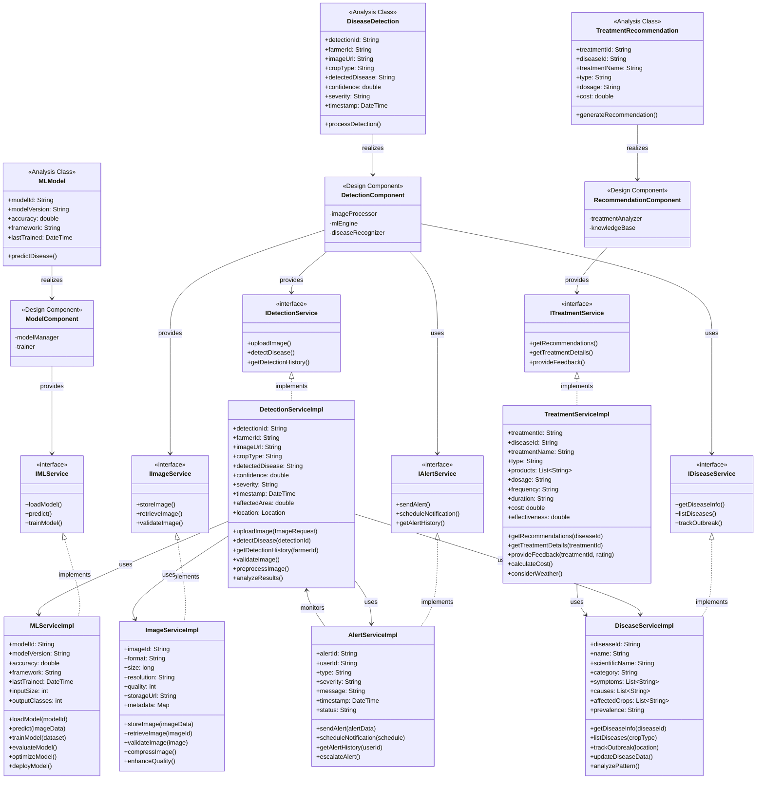
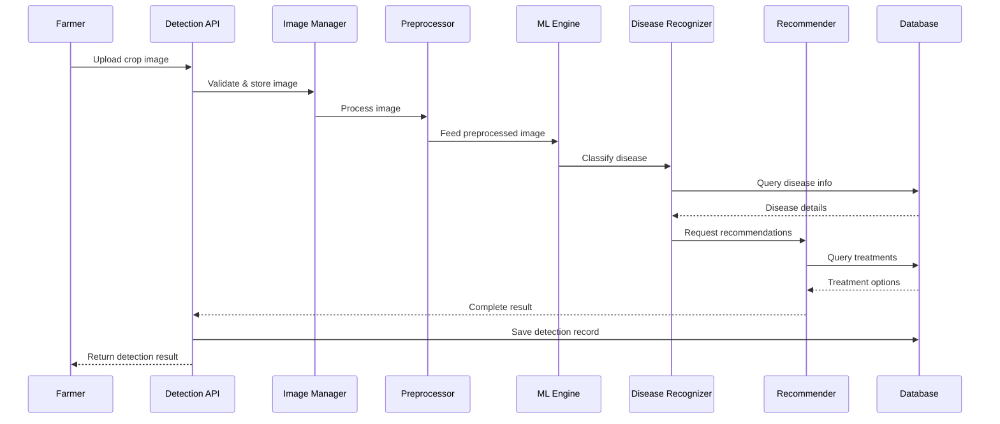
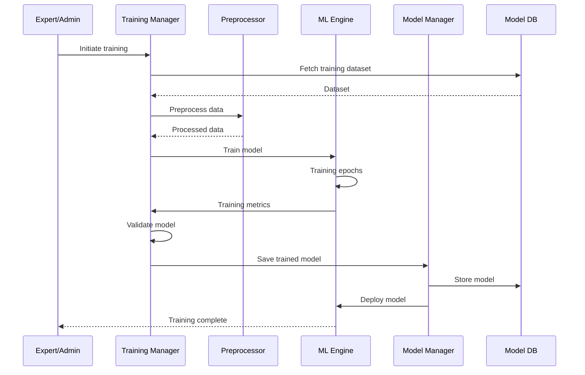
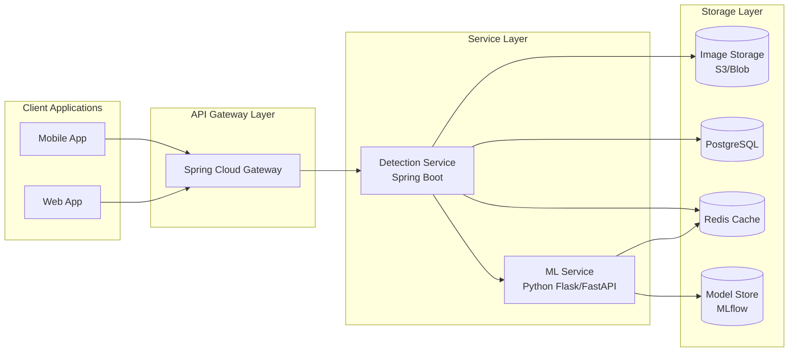

# Crop Disease Detection - Component Level Design

## Overview

The Crop Disease Detection system is an AI-powered component that analyzes crop images to identify diseases, pests, and deficiencies, providing farmers with instant diagnosis and treatment recommendations.

## Component Diagram



## Detailed Component Specifications

### 1. Detection API Controller

**Responsibilities:**

- Handle image upload requests
- Validate input data and formats
- Route detection requests
- Return detection results
- Manage API rate limiting

**REST Endpoints:**

```
POST   /api/disease-detection/detect
GET    /api/disease-detection/history/{farmerId}
GET    /api/disease-detection/result/{detectionId}
POST   /api/disease-detection/feedback
GET    /api/disease-detection/diseases
GET    /api/disease-detection/treatments/{diseaseId}
DELETE /api/disease-detection/{detectionId}
```

**Input Format:**

```json
{
  "farmerId": "string",
  "cropType": "string",
  "imageBase64": "string",
  "location": {
    "latitude": "number",
    "longitude": "number"
  },
  "timestamp": "datetime"
}
```

**Output Format:**

```json
{
  "detectionId": "string",
  "disease": {
    "name": "string",
    "scientificName": "string",
    "severity": "LOW|MEDIUM|HIGH|CRITICAL"
  },
  "confidence": "number",
  "affectedArea": "number",
  "treatments": [],
  "preventiveMeasures": [],
  "estimatedLoss": "string",
  "urgency": "string"
}
```

---

### 2. Image Manager

**Responsibilities:**

- Receive and validate images
- Check image quality and resolution
- Store images securely
- Manage image metadata
- Handle multiple image formats

**Validation Rules:**

- Supported formats: JPEG, PNG, HEIC
- Minimum resolution: 224x224 pixels
- Maximum size: 10MB
- Quality threshold: 70%

**Dependencies:**

- Image Storage Database
- Image Preprocessor

---

### 3. Image Preprocessor

**Responsibilities:**

- Resize images to model input size
- Normalize pixel values
- Apply image augmentation
- Remove noise and artifacts
- Enhance image quality

**Processing Pipeline:**

```
1. Resize to 224x224 or 299x299
2. Convert to RGB format
3. Normalize (mean=[0.485, 0.456, 0.406], std=[0.229, 0.224, 0.225])
4. Apply data augmentation (training only)
5. Convert to tensor format
```

**Dependencies:**

- ML Model Engine
- Training Manager

---

### 4. ML Model Engine

**Responsibilities:**

- Load trained models
- Execute inference
- Manage model versions
- Optimize performance
- Handle batch processing

**Models Supported:**

- CNN (Convolutional Neural Networks)
- ResNet50/ResNet101
- InceptionV3
- EfficientNet
- MobileNetV2 (for mobile deployment)
- Custom ensemble models

**Performance Targets:**

- Inference time: < 2 seconds
- Accuracy: > 90%
- F1-Score: > 0.88

**Dependencies:**

- Model Database
- Disease Classifier
- Model Manager

---

### 5. Disease Recognizer

**Responsibilities:**

- Classify detected diseases
- Calculate detection confidence
- Identify disease stages
- Determine affected area
- Assess severity level

**Classification Categories:**

- Fungal Diseases (Rust, Blight, Mildew)
- Bacterial Diseases (Leaf Spot, Canker)
- Viral Diseases (Mosaic, Curl)
- Pest Damage (Aphids, Caterpillars)
- Nutrient Deficiencies (N, P, K deficiencies)
- Environmental Stress (Drought, Heat)

**Dependencies:**

- Disease Database
- Confidence Calculator
- Disease Manager

---

### 6. Recommendation Analyzer

**Responsibilities:**

- Generate treatment recommendations
- Provide preventive measures
- Estimate crop loss
- Calculate treatment costs
- Consider weather conditions

**Recommendation Types:**

1. **Chemical Treatment:** Pesticides, fungicides
2. **Organic Treatment:** Bio-pesticides, natural remedies
3. **Cultural Practices:** Crop rotation, spacing
4. **Preventive Measures:** Early detection, monitoring
5. **Emergency Actions:** Immediate interventions

**Dependencies:**

- Treatment Manager
- Weather Service
- Knowledge Base

---

### 7. Training Manager

**Responsibilities:**

- Collect training data
- Manage dataset versions
- Orchestrate model training
- Validate model performance
- Deploy trained models

**Training Pipeline:**

```
1. Data Collection
2. Data Labeling
3. Data Augmentation
4. Model Training
5. Validation
6. Testing
7. Deployment
```

**Dependencies:**

- Model Database
- Image Preprocessor

---

### 8. Model Manager

**Responsibilities:**

- Store model versions
- Load/unload models
- Track model performance
- Manage model lifecycle
- A/B testing of models

**Version Control:**

- Model versioning (v1.0, v1.1, etc.)
- Rollback capability
- Performance metrics tracking
- Model comparison

**Dependencies:**

- Model Database
- ML Model Engine

---

### 9. Disease Classifier

**Responsibilities:**

- Maintain disease taxonomy
- Map predictions to diseases
- Handle multi-class classification
- Manage disease relationships
- Update disease database

**Disease Hierarchy:**

```
Crop Type
  └── Disease Category
      └── Disease Name
          └── Disease Variant
              └── Severity Level
```

**Dependencies:**

- Disease Database

---

### 10. Confidence Calculator

**Responsibilities:**

- Calculate prediction confidence
- Apply confidence thresholds
- Handle uncertain cases
- Flag low-confidence detections
- Trigger expert review

**Confidence Levels:**

- High: > 90% - Auto-accept
- Medium: 70-90% - Review recommended
- Low: < 70% - Expert review required

**Dependencies:**

- Disease Recognizer

---

### 11. Disease Manager

**Responsibilities:**

- Maintain disease information
- Update disease patterns
- Track disease outbreaks
- Manage disease metadata
- Provide disease analytics

**Disease Attributes:**

- Disease ID
- Common name
- Scientific name
- Symptoms
- Causes
- Spread mechanism
- Affected crops
- Geographic prevalence

**Dependencies:**

- Disease Database
- Alert Manager

---

### 12. Treatment Manager

**Responsibilities:**

- Store treatment protocols
- Recommend treatments
- Track treatment effectiveness
- Provide dosage information
- Estimate treatment costs

**Treatment Protocol:**

```json
{
  "treatmentId": "string",
  "diseaseId": "string",
  "name": "string",
  "type": "CHEMICAL|ORGANIC|CULTURAL",
  "products": [],
  "dosage": "string",
  "frequency": "string",
  "duration": "string",
  "cost": "number",
  "effectiveness": "number"
}
```

**Dependencies:**

- Knowledge Base
- Expert Advisory Manager

---

### 13. History Manager

**Responsibilities:**

- Record detection history
- Track farmer submissions
- Store detection results
- Generate reports
- Provide analytics

**Historical Data:**

- Detection timestamp
- Farmer ID
- Crop type
- Disease detected
- Confidence score
- Treatment recommended
- Outcome (if available)

**Dependencies:**

- History Database

---

### 14. Alert Manager

**Responsibilities:**

- Send critical alerts
- Notify disease outbreaks
- Alert on severe cases
- Push treatment reminders
- Escalate to experts

**Alert Types:**

1. **Critical:** Severe disease, immediate action
2. **Warning:** Disease detected, treatment needed
3. **Info:** Low severity, monitoring advised
4. **Outbreak:** Multiple cases in region

**Dependencies:**

- Notification Platform
- Disease Manager

---

## Data Flow Diagrams

### Disease Detection Flow



### Model Training Flow



---

## Technology Stack

### Machine Learning

- **Framework:** TensorFlow / PyTorch
- **Model Format:** ONNX, TensorFlow SavedModel
- **Deployment:** TensorFlow Serving, ONNX Runtime
- **GPU Support:** CUDA, cuDNN

### Image Processing

- **Library:** OpenCV, Pillow
- **Format Support:** JPEG, PNG, HEIC
- **Augmentation:** imgaug, Albumentations

### Backend

- **Framework:** Spring Boot
- **Language:** Java + Python (for ML)
- **API:** REST, gRPC (for ML service)
- **Async:** Spring WebFlux (for heavy processing)

### Storage

- **Image Storage:** AWS S3 / Azure Blob / MinIO
- **Database:** PostgreSQL / MySQL
- **Model Storage:** MLflow, DVC
- **Cache:** Redis (for frequent queries)

### Integration

- **Message Queue:** RabbitMQ / Kafka (for async processing)
- **API Gateway:** Spring Cloud Gateway
- **Service Mesh:** Optional (for microservices)

---

## Implementation Architecture



---

## Performance Optimization

### 1. Caching Strategy

- Cache frequent disease queries
- Cache model predictions for similar images
- Cache treatment recommendations
- TTL: 1 hour for predictions, 24 hours for disease info

### 2. Image Optimization

- Compress images before storage
- Use CDN for image delivery
- Lazy load historical images
- Thumbnail generation

### 3. Model Optimization

- Model quantization (INT8)
- Pruning unused weights
- TensorRT optimization (NVIDIA GPU)
- Batch inference for multiple images

### 4. Async Processing

- Queue-based image processing
- Background model updates
- Async notification delivery
- Batch database writes

---

## Security & Privacy

### 1. Data Protection

- Encrypt images at rest (AES-256)
- Encrypt data in transit (TLS 1.3)
- Anonymize farmer data
- GDPR compliance

### 2. Access Control

- JWT authentication
- Role-based authorization
- API key for ML service
- Rate limiting (100 requests/hour/farmer)

### 3. Model Security

- Model encryption
- Access control for model endpoints
- Input validation to prevent adversarial attacks
- Audit logging

---

## Monitoring & Metrics

### Key Performance Indicators

```
1. Detection Accuracy: > 90%
2. Response Time: < 3 seconds
3. Uptime: > 99.9%
4. False Positive Rate: < 5%
5. User Satisfaction: > 4.5/5
```

### Monitoring Tools

- **Application:** Prometheus + Grafana
- **Logs:** ELK Stack (Elasticsearch, Logstash, Kibana)
- **Tracing:** Jaeger / Zipkin
- **Alerts:** PagerDuty / Slack

### Metrics to Track

- Request rate
- Detection latency
- Model inference time
- Error rate
- Confidence score distribution
- Disease detection trends

---

## Error Handling

### Common Errors

| Error Code | Description            | Action                   |
| ---------- | ---------------------- | ------------------------ |
| 400        | Invalid image format   | Return supported formats |
| 413        | Image too large        | Return size limit        |
| 422        | Poor image quality     | Request better image     |
| 500        | Model inference failed | Retry or escalate        |
| 503        | Service unavailable    | Queue request            |

### Fallback Strategy

1. If ML model fails → Queue for manual review
2. If confidence < 70% → Escalate to expert
3. If service down → Store request, process later
4. If no match found → Request additional images

---

## Integration Points

### Inbound

- **Farmer App:** Image upload, detection request
- **Expert Advisory:** Manual disease confirmation
- **Weather Service:** Contextual data for recommendations

### Outbound

- **Notification Service:** Alert farmers
- **Expert Advisory:** Escalate uncertain cases
- **Disease Detection Service:** Share disease data
- **Analytics Platform:** Disease outbreak tracking

---

## Future Enhancements

1. **Real-time Detection:** Video stream analysis
2. **IoT Integration:** Drone/camera integration
3. **Predictive Analytics:** Disease outbreak prediction
4. **Multi-disease Detection:** Detect multiple diseases in one image
5. **Progressive Web App:** Offline detection capability
6. **Federated Learning:** Train on distributed farmer data
7. **Explainable AI:** Show which image regions indicate disease
8. **Mobile Edge Computing:** On-device inference
9. **AR Integration:** Augmented reality overlay of affected areas
10. **Voice Interface:** Voice-based disease reporting

---

## API Integration Example

### Java Controller Implementation

```java
@RestController
@RequestMapping("/api/disease-detection")
public class DiseaseDetectionController {

    @Autowired
    private ImageManager imageManager;

    @Autowired
    private MLModelEngine mlEngine;

    @PostMapping("/detect")
    public ResponseEntity<DetectionResult> detectDisease(
        @RequestBody DetectionRequest request) {

        // Validate and store image
        Image image = imageManager.processImage(request.getImageBase64());

        // Preprocess and detect
        DetectionResult result = mlEngine.detect(image, request.getCropType());

        // Save to history
        historyManager.saveDetection(request.getFarmerId(), result);

        // Send notification if critical
        if (result.getSeverity() == Severity.CRITICAL) {
            alertManager.sendCriticalAlert(request.getFarmerId(), result);
        }

        return ResponseEntity.ok(result);
    }
}
```

### Python ML Service Implementation

```python
@app.post("/predict")
async def predict_disease(image: UploadFile):
    # Preprocess image
    img_array = preprocess_image(image)

    # Run inference
    prediction = model.predict(img_array)
    disease_id = np.argmax(prediction)
    confidence = float(np.max(prediction))

    # Get disease info
    disease = disease_db.get_disease(disease_id)

    return {
        "disease": disease,
        "confidence": confidence,
        "severity": calculate_severity(disease_id, confidence)
    }
```

---

## Deployment Strategy

### Development Environment

- Local model training
- Sample dataset (1000 images)
- PostgreSQL Docker container
- MinIO for local storage

### Staging Environment

- GPU-enabled server for inference
- Full test dataset
- PostgreSQL RDS
- S3 bucket

### Production Environment

- Load-balanced detection service
- GPU cluster for ML inference
- Multi-region database replication
- CDN for image delivery
- Auto-scaling based on load

---

## Testing Strategy

### Unit Testing

- Image validation logic
- Preprocessing functions
- API endpoints
- Disease classification logic

### Integration Testing

- End-to-end detection flow
- Database operations
- External service integration
- ML model inference

### Performance Testing

- Load testing (1000 concurrent requests)
- Stress testing (peak load)
- Model inference benchmark
- Database query optimization

### Model Testing

- Accuracy testing on test set
- Cross-validation
- A/B testing new models
- Edge case testing
