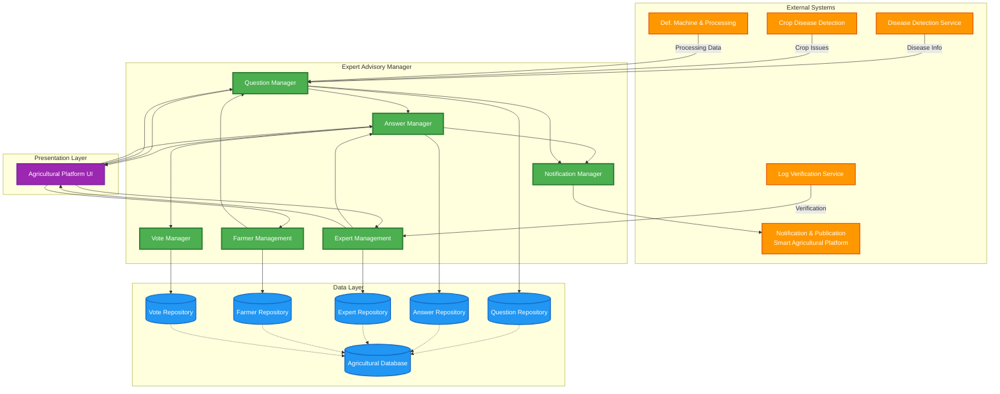
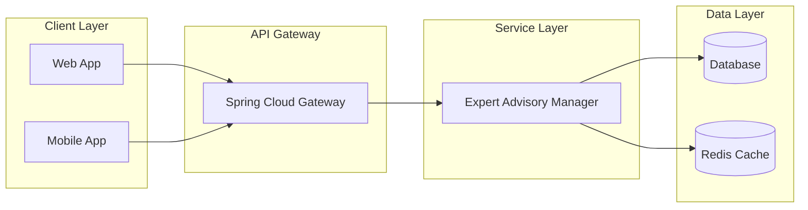

# Expert Advisory Manager - Component Level Design

## Architecture Overview

```
┌─────────────────────────────────────────────────────────────┐
│                    Analysis Class                            │
│  ┌─────────────────────────────────────────────────────┐   │
│  │              ExpertAdvisoryManager                   │   │
│  ├─────────────────────────────────────────────────────┤   │
│  │ + expertId: Long                                     │   │
│  │ + name: String                                       │   │
│  │ + email: String                                      │   │
│  │ + password: String                                   │   │
│  │ + phone: String                                      │   │
│  │ + specialization: String                             │   │
│  │ + location: String                                   │   │
│  ├─────────────────────────────────────────────────────┤   │
│  │ + answerQuestion()                                   │   │
│  │ + viewQuestions()                                    │   │
│  │ + updateProfile()                                    │   │
│  │ + trackAnswers()                                     │   │
│  └─────────────────────────────────────────────────────┘   │
└─────────────────────────────────────────────────────────────┘
                            │
                            │
                            ▼
        ┌───────────────────────────────────────┐
        │      Design Component                  │
        │                                        │
        │  ┌──────────────────────┐             │
        │  │  viewQuestions       │◄────────┐   │
        │  └──────────────────────┘         │   │
        │           │                        │   │
        │  ┌──────────────────────┐         │   │
        │  │  ExpertAdvisory      │         │   │
        │  │  Manager             │─────────┘   │
        │  └──────────────────────┘             │
        │           │                            │
        │  ┌──────────────────────┐             │
        │  │  answerQuestion      │             │
        │  └──────────────────────┘             │
        └───────────────────────────────────────┘
                            │
                            │
                            ▼
┌─────────────────────────────────────────────────────────────┐
│              Elaborated Design Class                         │
│  ┌──────────────────────────────┬──────────────────────┐   │
│  │    <<interface>>             │    <<interface>>     │   │
│  │  AnswerQuestionService       │  ViewQuestionService │   │
│  ├──────────────────────────────┼──────────────────────┤   │
│  │ + answerQuestion()           │ + viewQuestions()    │   │
│  │ + getAnswersByExpert()       │ + searchQuestions()  │   │
│  │ + getAnswerCount()           │ + getQuestionById()  │   │
│  │ + updateAnswer()             │ + filterQuestions()  │   │
│  └────────────────┬─────────────┴────────┬────────────┘   │
│                   │                       │                 │
│                   │ implements            │ implements      │
│                   ▼                       ▼                 │
│  ┌──────────────────────────────────────────────────────┐  │
│  │    ExpertAdvisoryManagerImpl                          │  │
│  ├──────────────────────────────────────────────────────┤  │
│  │ - expertId: Long                                     │  │
│  │ - name: String                                       │  │
│  │ - email: String                                      │  │
│  │ - password: String                                   │  │
│  │ - phone: String                                      │  │
│  │ - village: String                                    │  │
│  │ - city: String                                       │  │
│  │ - district: String                                   │  │
│  │ - country: String                                    │  │
│  │ - specialization: String                             │  │
│  │ - numberOfAnswers: Integer                           │  │
│  ├──────────────────────────────────────────────────────┤  │
│  │ ANSWER QUESTION METHODS:                             │  │
│  │ + answerQuestion(questionId: Long,                  │  │
│  │                  answerText: String,                │  │
│  │                  expertEmail: String): Answer        │  │
│  │                                                       │  │
│  │ + getAnswersByExpert(expertEmail: String):           │  │
│  │                      List<Answer>                    │  │
│  │                                                       │  │
│  │ + getAnswerCountForQuestion(questionId: Long): Long  │  │
│  │                                                       │  │
│  │ + updateAnswer(answerId: Long, answerText: String):  │  │
│  │               Answer                                  │  │
│  │                                                       │  │
│  │ VIEW QUESTION METHODS:                               │  │
│  │ + viewQuestions(): List<Question>                    │  │
│  │                                                       │  │
│  │ + searchQuestions(keyword: String): List<Question>   │  │
│  │                                                       │  │
│  │ + getQuestionById(questionId: Long): Question        │  │
│  │                                                       │  │
│  │ + filterQuestions(specialization: String,            │  │
│  │                   status: String): List<Question>    │  │
│  │                                                       │  │
│  │ PROFILE MANAGEMENT METHODS:                          │  │
│  │ + updateExpertProfile(expert: Expert): Expert        │  │
│  │                                                       │  │
│  │ + authenticateExpert(email: String,                  │  │
│  │                      password: String): Boolean      │  │
│  │                                                       │  │
│  │ + registerExpert(expert: Expert): Expert             │  │
│  └──────────────────────────────────────────────────────┘  │
└─────────────────────────────────────────────────────────────┘
```

## Component Responsibilities

### Analysis Class: ExpertAdvisoryManager

High-level abstraction representing an agricultural expert who provides advisory services to farmers through a Q&A system.

**Key Attributes:**

- Expert identification and contact information
- Area of specialization
- Location details

**Key Operations:**

- Answer farmer questions
- Browse and search questions
- Manage expert profile

### Design Component

Architectural middle layer connecting the analysis model to the implementation, showing the main interactions:

- **viewQuestions**: Browse all available farmer questions
- **answerQuestion**: Provide expert answers to farmer queries
- Bidirectional flow between viewing and answering operations

### Elaborated Design Class: ExpertAdvisoryManagerImpl

**Interface 1: AnswerQuestionService**
Defines the contract for expert answering operations

- Create answers to farmer questions
- Retrieve answers by expert
- Track answer count per question
- Update existing answers

**Interface 2: ViewQuestionService**
Defines the contract for viewing and searching questions

- View all available questions
- Search questions by keywords
- Retrieve specific questions by ID
- Filter questions by specialization or status

**Implementation: ExpertAdvisoryManagerImpl**
Complete implementation implementing both interfaces with detailed attributes and methods for:

1. **Answer Question Operations** (via AnswerQuestionService)
   - Create detailed answers to farmer questions with timestamps
   - Retrieve all answers provided by a specific expert
   - Count answers per question for popularity tracking
   - Update or revise existing answers
   - Maintain answer quality metrics

2. **View Question Operations** (via ViewQuestionService)
   - View all unanswered questions available for expert
   - Search questions by keywords (crop type, issue, etc.)
   - Retrieve specific question details by ID
   - Filter questions based on expert specialization
   - Filter by question status (answered/unanswered)

3. **Profile Management**
   - Register new experts

   - Update expert information
   - Authenticate expert login

4. **Analytics**
   - Track number of answers provided
   - Monitor expert activity
   - Generate expert performance metrics

## Related Entities

- **Question**: Farmer queries requiring expert attention
- **Answer**: Expert responses to farmer questions
- **Farmer**: Users who ask questions
- **AnswerVote**: Community validation of answer quality

## Data Flow

1. Farmer submits question through Question entity
2. Expert views available questions via viewQuestions()
3. Expert provides answer using answerQuestion()
4. Answer is stored with reference to Question and Expert
5. System tracks answer count and expert activity

## Integration Points

- **QuestionController**: RESTful endpoints for question operations
- **AnswerController**: RESTful endpoints for answer operations
- **QuestionRepository**: Data persistence for questions
- **AnswerRepository**: Data persistence for answers
- **ExpertRepo**: Data persistence for expert profiles

---

## Original System Design (for reference)

### System Component Diagram



## Component Details

### 1. Question Manager

**Responsibilities:**

- Receive questions from farmers
- Process disease detection inputs
- Validate and categorize questions
- Assign questions to appropriate experts
- Track question status

**Interfaces:**

- `POST /api/questions` - Create new question
- `GET /api/questions/{id}` - Get question details
- `GET /api/questions` - List questions with filters
- `PUT /api/questions/{id}` - Update question
- `DELETE /api/questions/{id}` - Delete question

**Dependencies:**

- Question Repository
- Farmer Management
- Disease Detection Service
- Notification Manager

---

### 2. Answer Manager

**Responsibilities:**

- Enable experts to provide answers
- Validate answer content
- Manage answer lifecycle
- Track answer metadata
- Link answers to questions

**Interfaces:**

- `POST /api/answers` - Create answer
- `GET /api/answers/{id}` - Get answer details
- `GET /api/questions/{questionId}/answers` - Get all answers for a question
- `PUT /api/answers/{id}` - Update answer
- `DELETE /api/answers/{id}` - Delete answer

**Dependencies:**

- Answer Repository
- Vote Manager
- Expert Management
- Notification Manager

---

### 3. Expert Management

**Responsibilities:**

- Register and authenticate experts
- Manage expert profiles
- Track expert specializations
- Verify expert credentials
- Monitor expert performance

**Interfaces:**

- `POST /api/experts/register` - Register expert
- `POST /api/experts/login` - Expert login
- `GET /api/experts/{id}` - Get expert profile
- `PUT /api/experts/{id}` - Update expert profile
- `GET /api/experts` - List experts by specialization

**Dependencies:**

- Expert Repository
- Log Verification Service

---

### 4. Farmer Management

**Responsibilities:**

- Register and authenticate farmers
- Manage farmer profiles
- Track farmer fields and crops
- Maintain farmer history
- Manage farmer preferences

**Interfaces:**

- `POST /api/farmers/register` - Register farmer
- `POST /api/farmers/login` - Farmer login
- `GET /api/farmers/{id}` - Get farmer profile
- `PUT /api/farmers/{id}` - Update farmer profile
- `GET /api/farmers/{id}/fields` - Get farmer fields

**Dependencies:**

- Farmer Repository
- Field Repository

---

### 5. Vote Manager

**Responsibilities:**

- Handle upvotes/downvotes on answers
- Prevent duplicate votes
- Calculate answer ratings
- Track vote history
- Update answer scores

**Interfaces:**

- `POST /api/answers/{id}/vote` - Vote on answer
- `GET /api/answers/{id}/votes` - Get vote statistics
- `DELETE /api/answers/{answerId}/vote` - Remove vote

**Dependencies:**

- Vote Repository
- Answer Repository

---

### 6. Notification Manager

**Responsibilities:**

- Send notifications to farmers
- Alert experts of new questions
- Notify on answer updates
- Push critical alerts
- Manage notification preferences

**Interfaces:**

- `POST /api/notifications/send` - Send notification
- `GET /api/notifications/{userId}` - Get user notifications
- `PUT /api/notifications/{id}/read` - Mark as read

**Dependencies:**

- Notification & Publication Service

---

## Data Flow

### Question Submission Flow

1. Farmer creates question via Agricultural Platform
2. Question Manager receives and validates question
3. Disease Detection Service (optional) provides context
4. Question stored in Question Repository
5. Notification Manager alerts relevant experts
6. Expert receives notification via platform

### Answer Submission Flow

1. Expert views question via Agricultural Platform
2. Expert submits answer via Answer Manager
3. Answer Manager validates and stores answer
4. Notification Manager alerts farmer
5. Farmer receives notification and views answer
6. Farmer can vote on answer quality

### Vote Flow

1. Farmer/Expert votes on answer
2. Vote Manager validates vote (no duplicates)
3. Vote stored in Vote Repository
4. Answer score updated
5. Answer ranking adjusted

---

## Technology Stack

### Backend Components

- **Framework:** Spring Boot
- **Language:** Java
- **Database:** MySQL/PostgreSQL (via repositories)
- **ORM:** JPA/Hibernate

### Controllers (Implemented)

- `QuestionController.java` - Question Manager API
- `AnswerController.java` - Answer Manager API
- `AnswerVoteController.java` - Vote Manager API
- `Login.java` - Authentication
- `RegiCon.java` - Registration

### Entities (Implemented)

- `Question.java` - Question model
- `Answer.java` - Answer model
- `AnswerVote.java` - Vote model
- `Expert.java` - Expert model
- `Farmer.java` - Farmer model

### Repositories (Implemented)

- `QuestionRepository.java` - Question data access
- `AnswerRepository.java` - Answer data access
- `AnswerVoteRepository.java` - Vote data access
- `ExpertRepo.java` - Expert data access
- `FarmerRepo.java` - Farmer data access

---

## Security Considerations

1. **Authentication:** JWT-based authentication for both farmers and experts
2. **Authorization:** Role-based access control (RBAC)
3. **Input Validation:** Sanitize all user inputs
4. **Rate Limiting:** Prevent spam questions/answers
5. **Data Privacy:** Encrypt sensitive farmer and expert data

---

## Integration Points

### Inbound Integrations

- Disease Detection Service → Question context
- Crop Disease Detection → Automated question creation
- Agricultural Platform UI → User interactions
- Log Verification → Expert credential validation

### Outbound Integrations

- Notification Service → Push notifications
- Agricultural Database → Data persistence
- Smart Agricultural Platform → Publishing content

---

## Deployment Architecture



---

## Performance Considerations

1. **Caching:** Redis cache for frequently accessed questions/answers
2. **Pagination:** Limit query results for listing operations
3. **Async Processing:** Use async for notifications
4. **Database Indexing:** Index on commonly queried fields
5. **Connection Pooling:** Manage database connections efficiently

---

## Future Enhancements

1. **AI-Powered Recommendations:** Suggest similar questions/answers
2. **Real-time Chat:** Enable direct farmer-expert communication
3. **Multimedia Support:** Allow image/video attachments
4. **Analytics Dashboard:** Track expert performance and question trends
5. **Multi-language Support:** Localization for different regions
6. **Expert Rating System:** Comprehensive expert evaluation
7. **Knowledge Base:** Build searchable repository of Q&A
